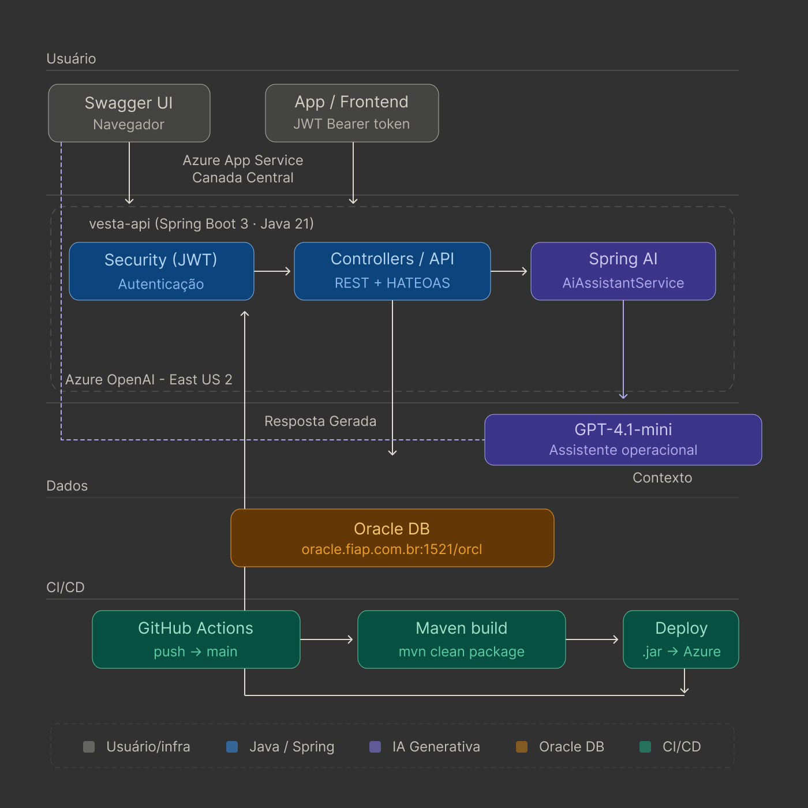

# Vesta — Plataforma de Gestão Operacional de Abrigos

> Solução funcional de **IA Generativa** aplicada à gestão de abrigos em situações de desastre, integrando Spring AI, Azure OpenAI e Oracle DB em um pipeline de deploy automatizado via GitHub Actions.

---

## Sumário

- [Problema e solução](#problema-e-solução)
- [Trilha escolhida](#trilha-escolhida)
- [Arquitetura da solução](#arquitetura-da-solução)
- [Stack tecnológica](#stack-tecnológica)
- [Estrutura do repositório](#estrutura-do-repositório)
- [Como executar localmente](#como-executar-localmente)
- [Como executar via Docker](#como-executar-via-docker)
- [Deploy na Azure](#deploy-na-azure)
- [Endpoints da API](#endpoints-da-api)
- [Módulo de IA Generativa](#módulo-de-ia-generativa)
- [Variáveis de ambiente](#variáveis-de-ambiente)
- [Integrantes](#integrantes)
- [Vídeo de execução](#vídeo-de-execução)

---

## Problema e solução

Em situações de desastre, gestores de defesa civil precisam tomar decisões rápidas sobre dezenas de abrigos simultaneamente — identificar superlotações, redistribuir recursos, priorizar atendimentos. O volume de dados operacionais torna impossível analisar tudo manualmente em tempo real.

A plataforma **Vesta** centraliza a gestão operacional desses abrigos. O módulo de **IA Generativa** adiciona um assistente inteligente que interpreta os dados em tempo real e responde perguntas do gestor em linguagem natural, fundamentando cada resposta nos dados reais do banco Oracle.

---

## Trilha escolhida

**IA Generativa** — desenvolvimento de solução utilizando modelos generativos e linguagem natural, com assistente inteligente integrado à API Java via Spring AI, conectado ao Azure OpenAI (GPT-4.1-mini), com interface interativa via Swagger e processamento contextual dos dados operacionais dos abrigos.

---

## Arquitetura da solução


### Fluxo do assistente de IA

1. Gestor envia pergunta via `POST /api/assistente`
2. `AiAssistantService` busca dados reais do Oracle (abrigos, estoque, ocorrências)
3. Monta o snapshot operacional como contexto estruturado
4. Envia contexto + pergunta ao GPT-4.1-mini via Spring AI
5. Modelo responde em português com base exclusivamente nos dados fornecidos
6. Resposta retornada ao gestor com o contexto utilizado

---

## Stack tecnológica

| Camada | Tecnologia |
|---|---|
| Linguagem | Java 21 |
| Framework | Spring Boot 3.3.4 |
| IA Generativa | Spring AI 1.0.0 + Azure OpenAI |
| Modelo | GPT-4.1-mini (Azure AI Foundry) |
| Banco de dados | Oracle 19c (Flyway migrations) |
| Segurança | Spring Security + JWT (jjwt 0.12.6) |
| Documentação | Springdoc OpenAPI 2.6.0 (Swagger UI) |
| Cloud | Azure App Service (Canada Central) |
| CI/CD | GitHub Actions |

---

## Estrutura do repositório

```
vesta-ai/
├── .github/
│   └── workflows/
│       └── main_vesta-api.yml      ← pipeline CI/CD automático
├── src/
│   └── main/
│       ├── java/br/com/fiap/vesta/
│       │   ├── client/             ← FeignClient (.NET criticidade)
│       │   ├── config/             ← SecurityConfig, SpringAiConfig
│       │   ├── controller/         ← REST endpoints + AssistenteController
│       │   ├── domain/             ← Entities, Enums
│       │   ├── dto/                ← Request/Response DTOs
│       │   ├── exception/          ← GlobalExceptionHandler
│       │   ├── repository/         ← Spring Data JPA
│       │   ├── security/           ← JWT filter e provider
│       │   ├── service/            ← AiAssistantService + demais serviços
│       │   └── VestaApplication.java
│       └── resources/
│           ├── db/migration/       ← Scripts Flyway (V1 a V7)
│           ├── application.yml
│           └── application-test.yml
└── pom.xml
```

---

## Como executar localmente

### Pré-requisitos

- Java 21+
- Maven 3.9+
- Oracle DB acessível
- Conta Azure com recurso OpenAI provisionado

### 1. Clonar o repositório

```bash
git clone https://github.com/vesta-erp/vesta-ai.git
cd vesta-ai
```

### 2. Configurar variáveis de ambiente

```bash
export AZURE_OPENAI_API_KEY=sua_chave_aqui
export AZURE_OPENAI_ENDPOINT=https://seu-recurso.openai.azure.com
export AZURE_OPENAI_DEPLOYMENT=gpt-4.1-mini
export DB_VESTA_URL=jdbc:oracle:thin:@//oracle.fiap.com.br:1521/orcl
export DB_VESTA_USER=seu_usuario
export DB_VESTA_PASSWORD=sua_senha
```

### 3. Executar

```bash
mvn spring-boot:run
```

A API estará disponível em `http://localhost:8080`  
Swagger UI: `http://localhost:8080/swagger-ui/index.html`

---

## Como executar via Docker

```dockerfile
FROM eclipse-temurin:21-jre
WORKDIR /app
COPY target/*.jar app.jar
EXPOSE 8080
ENTRYPOINT ["java", "-jar", "app.jar"]
```

```bash
# Build
mvn clean package -DskipTests
docker build -t vesta-api .

# Run
docker run -p 8080:8080 \
  -e AZURE_OPENAI_API_KEY=... \
  -e AZURE_OPENAI_ENDPOINT=... \
  -e AZURE_OPENAI_DEPLOYMENT=gpt-4.1-mini \
  -e DB_VESTA_URL=... \
  -e DB_VESTA_USER=... \
  -e DB_VESTA_PASSWORD=... \
  vesta-api
```

---

## Deploy na Azure

O deploy é feito automaticamente via GitHub Actions a cada push na branch `main`.

### Recursos provisionados

| Recurso | Nome | Região |
|---|---|---|
| Resource Group | rg-vesta | Canada Central |
| App Service Plan | plan-vesta | Canada Central |
| Web App | vesta-api | Canada Central |
| Azure OpenAI | vesta-resource | East US 2 |
| Modelo implantado | gpt-4.1-mini | East US 2 |

### Pipeline CI/CD

```
push → main
  └── GitHub Actions
        ├── Checkout código
        ├── Setup Java 21 (Microsoft distribution)
        ├── mvn clean install
        ├── Upload artifact (.jar)
        └── Deploy → Azure App Service (via OIDC)
```

### Domínio Padrão Vesta AI

```
https://vesta-api-fdc2cgcbhwczd4eq.canadacentral-01.azurewebsites.net

```

---

 ## Endpoints da API

### Autenticação

```bash
POST /api/auth/login
Content-Type: application/json

{
  "email": "admin@vesta.gov.br",
  "senha": "admin123"
}
```

Copie o `token` retornado e use no Swagger em **Authorize → Bearer {token}**.

### Assistente de IA

```bash
POST /api/assistente
Authorization: Bearer {token}
Content-Type: application/json

{
  "pergunta": "Quais abrigos estão com ocupação acima de 90%?"
}
```

Exemplos de perguntas:

- `"Quais são os abrigos mais críticos agora?"`
- `"Quais recursos estão abaixo do estoque mínimo?"`
- `"Sugira a ordem de atendimento prioritário para hoje."`
- `"Por que o Abrigo Norte foi marcado como crítico?"`
- `"Quais solicitações estão atrasadas?"`

### Endpoint API

Acesse o Swagger para a documentação completa:

```
https://vesta-api-java-gwf7drgza3hjgfc6.brazilsouth-01.azurewebsites.net/swagger-ui/index.html#/
```

---

## Módulo de IA Generativa

### Como funciona

O `AiAssistantService` executa o seguinte fluxo a cada requisição:

```java
// 1. Busca dados reais do Oracle
List<EstoqueAbrigo> criticos = estoqueRepository
    .findItensAbaixoMinimoPorAbrigo(idAbrigo);
long ocorrenciasAbertas = ocorrenciaRepository
    .countByAbrigoIdAbrigoAndStStatusNot(id, StatusOcorrencia.RESOLVIDA);

// 2. Monta contexto estruturado
String contexto = String.format("""
    Abrigo: %s | Ocupação: %d/%d (%.1f%%)
    Itens críticos: %s
    Ocorrências abertas: %d
    """, ...);

// 3. Chama o modelo via Spring AI
String resposta = chatClient.prompt()
    .system("Você é um assistente operacional de abrigos...")
    .user("Com base nos dados abaixo: " + contexto + pergunta)
    .call()
    .content();
```

### Configuração do Spring AI

```yaml
spring:
  ai:
    azure:
      openai:
        api-key: ${AZURE_OPENAI_API_KEY}
        endpoint: ${AZURE_OPENAI_ENDPOINT}
        chat:
          options:
            deployment-name: ${AZURE_OPENAI_DEPLOYMENT:gpt-4.1-mini}
            temperature: 0.3
            max-tokens: 1000
```

---

## Variáveis de ambiente

| Variável | Descrição |
|---|---|
| `AZURE_OPENAI_API_KEY` | Chave de autenticação do Azure OpenAI |
| `AZURE_OPENAI_ENDPOINT` | URL do endpoint do recurso |
| `AZURE_OPENAI_DEPLOYMENT` | Nome da implantação (ex: `gpt-4.1-mini`) |
| `DB_VESTA_URL` | JDBC URL do Oracle |
| `DB_VESTA_USER` | Usuário do banco |
| `DB_VESTA_PASSWORD` | Senha do banco |
| `Jwt__SecretKey` | Chave secreta para geração do JWT |
| `DOTNET_URL` | URL do serviço .NET de criticidade |

---

## Vídeo de execução
Link do Vídeo: 
[*link*](https://drive.google.com/file/d/1VVUvtg7pu_KD8QhJHA8Lk0VddsO6jIUQ/view?usp=sharing)

---

## Integrantes

| Nome | RM |
|---|---|
| Nathália Mantovani de Falco | RM99904 |
| Gabriel Cruz Ferreira | RM559613 |
| João Victor Ignacio Madella | RM561007 |
| Kauã Ferreira dos Santos | RM560992 |
| Vinicius da Silva Bitú | RM560227 |

---

*FIAP — Global Solution 2026 · Disruptive Architectures IoT, IOB e Generative IA*